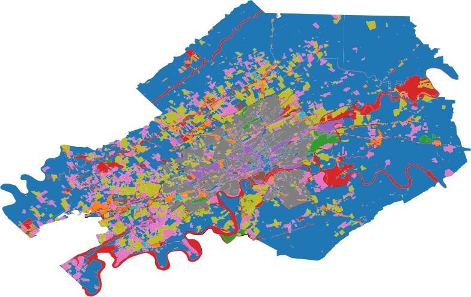

**All issues and contributions should be done on
[Gitlab](https://gitlab.com/costrouc/knoxville-opendata-notebooks). Github
is used only as a mirror for visibility**

# Knoxville OpenData Notebooks

I wanted to create some parsers on the data that knoxville provides
and make it more accessible for others. The goal of this work is to
provide easily accessible `csv`, `json` and `geojson` files of the
data. Also this can be thought of as a place to centralize the data
and allow users to brainstorm on how they can use the data.

An awesome binder notebook is provided to help with exploration of the
data. A binder notebooks is an jupyter notebook plus a google cloud
free compute instance. This means that only a web brower is needed to
program and explore the data.  While we could have created interactive
dashboards of the data this does not allow enough flexibility for the
user to be able to ask any question they may have. You will find that
the for each notebook the data is preloaded and a few simple questions
are solved.

# Resources

Sometimes multiple links for each data source exist. I will always
prefer open easy to parse data. Usually I get them in this order:
`csv`, `json`, `geojson`, `excel`, ... and others in no particular. A
check indicates that the data has a notebook and it ready to play
with! See binder link above for interacting with data.

## knoxmpc.org/opendata

Metropolitan Planning Commission (MPC) collects data to support its
planning efforts in Knoxville and Knox County. This data is not just
valuable to our agency, it is valuable to Knox County citizens.

 - [X] [Greenwas and Trails](https://knoxgis.maps.arcgis.com/home/item.html?id=5c1c99f1e6f94e60aec8325646473ab3)

 - [X] [Parks](https://knoxgis.maps.arcgis.com/home/item.html?id=2e82b2c2576441d6973dacad3173d36e)
 
 - [X] [Knoxville County Zoning](https://knoxgis.maps.arcgis.com/home/item.html?id=ca4ac10098dd4de995b16312c83665f4)

## knoxvilletn.gov/government/opendata

Here are some the data sources listed on the [knoxville open data website](http://knoxvilletn.gov/government/opendata/). A checked item indicates that the data has been parsed or is being worked on.

 - [X] [311 Performance Measures: Monthly reports of 311 requests](http://knoxvilletn.gov/government/city_departments_offices/311/performance_measures/)

 - [ ] [Blight Data Dashboard: Dashboard showing the City's effort to quantify and reduce the number of blighted properties within the City.](http://knoxvilletn.gov/cms/One.aspx?portalId=109562&pageId=9969128)

 - [ ] [Budget: View adopted operating budget files from 2001-2017.](http://knoxvilletn.gov/government/city_departments_offices/Finance/budget/budget_archive/)

 - [ ] [City Council Agendas/Minutes: Agenda files and meeting minutes are available for past and current City Council meetings and Beer Board meetings](http://knoxvilletn.gov/citycouncil)

 - [X] [Crime Map: View local crime stats on the LexisNexis Community Crime Map](http://communitycrimemap.com/?address=Knoxville,TN)

 - [ ] [East Tennessee Index: The East Tennessee Index compiles demographic, workforce, housing, socioeconomic and other data for a nine-county region around Knoxville.](http://etindex.org/)

 - [ ] [Homemaker Program: A list of vacant lots and lots with substandard structures for sale by the City to individuals, non-profit organizations and businesses](http://knoxvilletn.gov/government/city_departments_offices/community_development/homemaker_program/)

 - [ ] [KGIS Maps: Detailed, searchable maps show every property in Knoxville and Knox County, with information on property owner, sales price, zoning and other data.](http://www.kgis.org/kgismaps/Map.htm)

 - [ ] [KnoxHMIS: Informational resource on the issue of homelessness and the performance of homeless service providers in Knoxville](http://www.knoxhmis.org/dashboard/)

 - [ ] [Knoxville Area Transit (KAT) GTFS Feed: Our transit data is available in the General Transit Feed Specification (GTFS). This data set includes schedule data for all fixed routes of Knoxville Area Transit (KAT).](http://knoxvilletn.gov/cms/One.aspx?portalId=109562&pageId=11688599)

 - [ ] [NPDES Reports: National Pollutant Discharge Elimination System Reports submitted by the City's Stormwater Engineering Division](http://knoxvilletn.gov/government/city_departments_offices/engineering/stormwater_engineering_division/npdes_program/npdes_reports/)

 - [ ] [Police Advisory and Review Committee: PARC compiles its annual reports and meeting agendas and minutes.](http://knoxvilletn.gov/government/city_departments_offices/police_department/kpd_open_records_page/)

 - [ ] [Police Department: The Knoxville Police Department compiles information on Biased Based Policing, Officer Involved Shootings, Vehicle Flight Response and other metrics.](http://knoxvilletn.gov/government/city_departments_offices/police_department/kpd_open_records_page/)

 - [ ] [Property Tax Database - City: Search the City property tax database.](https://propertytax.knoxvilletn.gov/)

 - [ ] [Property Tax Database - County: Search the County property tax database.](http://www.knoxcounty.org/apps/tax_search/)

 - [ ] [Public Improvement Projects: Find information on current infrastructure projects from various City departments.](http://knoxvilletn.gov/projects)

 - [ ] [Rainfall Data: Rainfall data collected and maintained by the City's Stormwater Engineering Division](http://knoxvilletn.gov/government/city_departments_offices/engineering/stormwater_engineering_division/rainfall_data/)

 - [ ] [TIFs and PILOTs: You can find full details of all projects that have received City assistance in the form of Tax-Increment Financing and Payments In Lieu of Taxes.](http://knoxvilletn.gov/cms/One.aspx?portalId=109562&pageId=201883)

 - [X] [Tree Inventory: You can see a map of every tree on public property in the City of Knoxville identified by species. You can even send an email to your favorite tree!](http://www.kgis.org/maps/treeinventory.html)

# Contributing

All contributions, bug reports, bug fixes, documentation improvements,
enhancements and ideas are welcome! These should be submitted at the
[Gitlab
repository](https://gitlab.com/costrouc/knoxville-opendata-notebooks). Github
is only used for visibility. If you are storing any data files with
the commit make sure to use [LFS](https://git-lfs.github.com/).

Contributors:
 - Chris Ostrouchov [(maintainer)](https://gitlab.com/costrouc/)

# License

MIT

